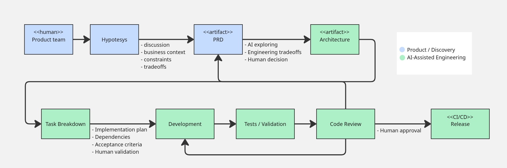

# Introduction

This repository shows a simplified version of how I worked with AI at Upwork and what I learned from it.

It is not an exact copy of the process, and it does not contain Upwork code or private information. The goal is to show how AI can support engineering work without replacing product decisions, technical judgment, or human approval.

The application is intentionally small so the development process remains the main focus.

# Overview



The product team defines the problem and writes the PRD. Engineering starts from that approved document.

AI then helps explore technical options, break down the work, implement it, and check the result. People remain responsible for discussing trade-offs, changing direction when needed, reviewing the code, and approving the release.

# Development process

The example feature is documented in [`docs/0001-shareable-project-search-filters/`](./docs/0001-shareable-project-search-filters/).

1. **PRD** — A person defines the problem, requirements, and acceptance criteria in `prd.md`.
2. **Architecture** — The investigation skill reads the PRD and codebase and presents possible approaches. An engineer discusses the trade-offs and approves the decision recorded in `architecture.md`.
3. **Planning** — The planning skill turns the approved decision into small implementation tasks. A person reviews and approves `planning.md`.
4. **Implementation** — The implementation skill follows the approved documents and changes the code. If something requires a new product or architecture decision, it stops and asks for guidance.
5. **Validation** — The validation skill checks the implementation against the acceptance criteria. It runs the checks it can and clearly lists anything that still requires a person to verify in the browser. Results are recorded in `validation.md`.
6. **Code review and release** — A person reviews the pull request, requests corrections when necessary, and decides whether it can be merged and released.

Feature work starts on a dedicated branch before architecture investigation. The skills under [`.agents/skills/`](./.agents/skills/) are started explicitly by a person; they do not move work through the process on their own.

# Missing parts

At work, AI could access more context through MCPs or other integrations with internal tools. This might include:

- product documents and tickets
- architecture and service ownership information
- API and design-system documentation
- build and deployment tools
- logs and monitoring
- feature flags

# Deterministic validation as a quality gate

AI can help find missing cases and compare the implementation with the requirements, but it should not replace checks with clear pass-or-fail results.

Before merging, a real project would normally require:

- a successful build
- linting
- unit and integration tests
- a Sonar quality gate
- any required security checks

If one of these checks fails, the change should not be merged even if the AI review looks good. After they pass, AI can provide extra feedback, and a person makes the final decision.

This demo currently includes the production build, API checks, and a manual browser checklist. Linting, automated tests, Sonar, internal integrations, and deployment are intentionally left out.

# Running WorkMatch

Requires Node.js 22 or newer and npm.

```bash
npm install
npm run dev
```

Open <http://localhost:5173>. The API runs at <http://localhost:3000>.

```bash
npm run build  # Build the frontend
npm start      # Start only the API
```
